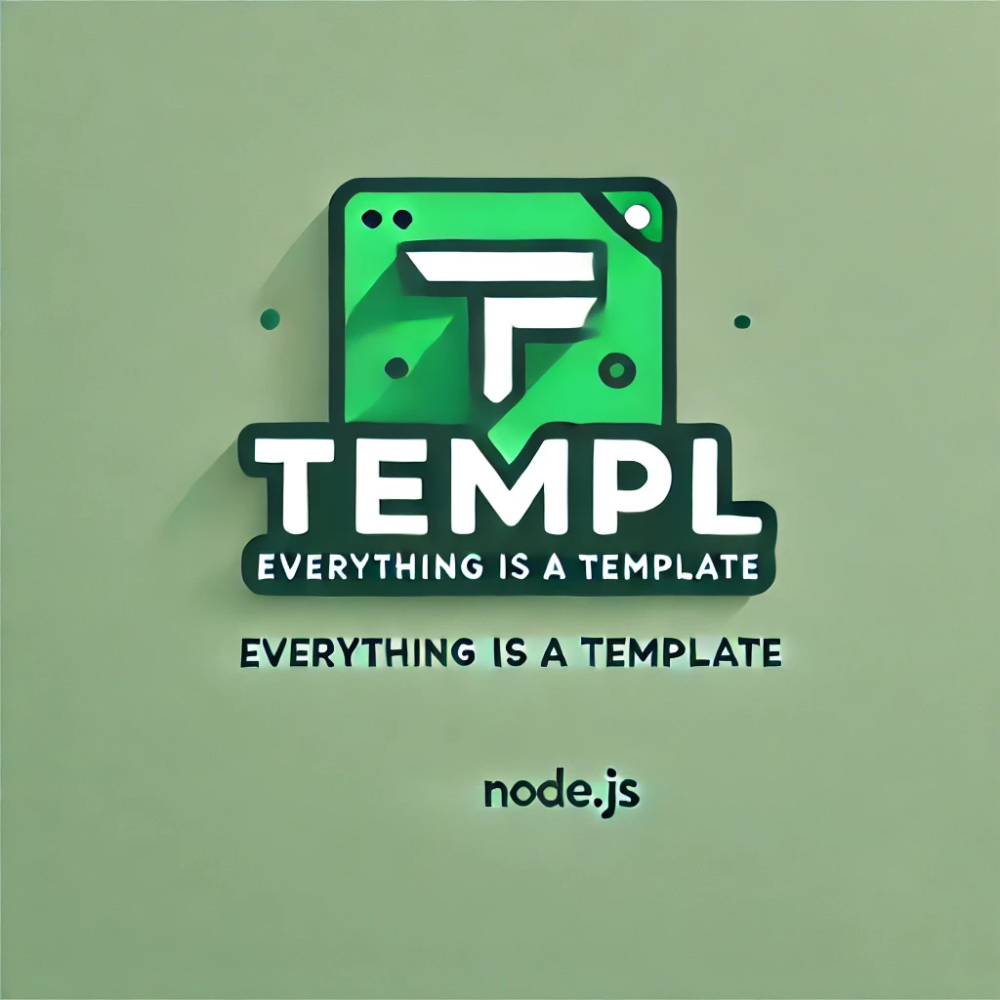

Everything is a template

<p align="center">
<a href="https://opensource.org/licenses/MIT" rel="nofollow"></a>
<a href="https://github.com/vbarbarosh/templ" rel="nofollow"></a>
</p>

<p align="center">

</p>

## Installation

```sh
git clone https://github.com/vbarbarosh/templ
npm install
```
