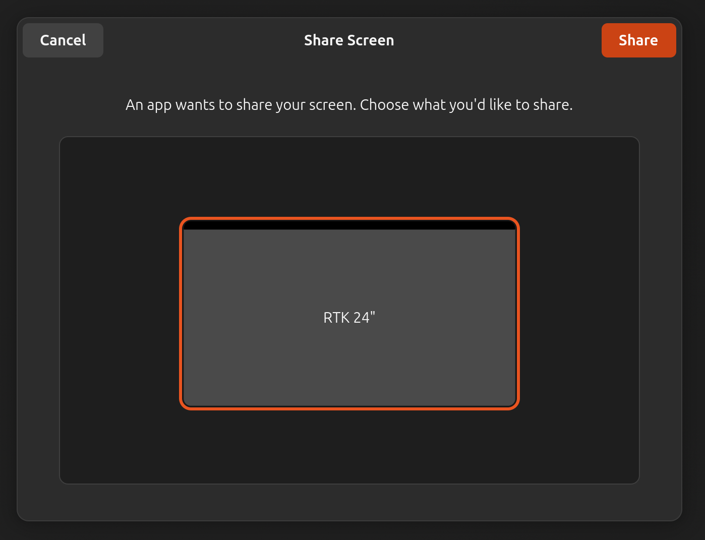

## Issue 1

The Share Screen consent prompt appears every time
`electron.desktopCapturer.getSources({types: ['screen']})` is called.



## Issue 2

After choosing *Cancel*, app crashes:

```text
[41804:0302/223844.021888:ERROR:screencast_portal.cc(367)] Failed to start the screen cast session.
[41804:0302/223844.021928:ERROR:base_capturer_pipewire.cc(81)] ScreenCastPortal failed: 2
/templ/templ.d/electron-capture-desktop/node_modules/electron/dist/electron exited with signal SIGSEGV
```
